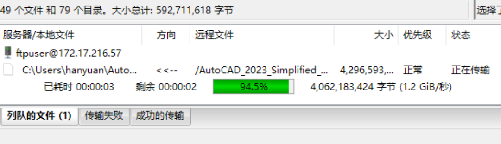

# Introduction

在高并发网络编程中，I/O多路复用技术是提升服务器性能的关键。POLL机制是一种广泛应用的I/O多路复用方法，它通过轮询一组文件描述符，检测其状态变化，实现对多个网络连接的高效管理。相比于为每个连接创建独立线程或进程的方法，如果同时有1000个连接，那么就需要新开1000个线程/进程，这会对服务器资源造成极大的浪费。使用POLL可以显著减少系统在内存、调度上的资源消耗，提升并发处理能力。

本作业中，我们在主线程中利用POLL的事件驱动机制处理控制通道的通信，同时启动另外两个线程分别处理PORT和PASV模式下的数据通道的POLL操作。这样的设计避免了为每个连接创建额外的线程或进程，充分发挥了POLL机制的优势，节约了CPU资源，提高了服务器的整体性能。

零拷贝技术是优化数据传输效率的重要手段。传统的数据传输需要从网络接收一点数据，又往文件系统中写入一些数据。这会导致计算机在用户态和内核态之间多次数据拷贝，增加了CPU的负载。通过使用`sendfile`系统调用，可以在内核态直接将文件数据从文件系统拷贝到网络缓冲区，避免了数据在用户态和内核态之间的拷贝过程。

由于POLL机制的使用与并发编程模型，服务器支持同时连接多个客户端（完全兼容FTP客户端FileZilla），能够快速列出包含5000个文件的目录，还支持**多个客户端同时下载大文件**，传输速率与业界知名的vsftpd服务器相当，并支持**断点续传**功能。具体比较如图1、图2所示。（速率只有`1.3 GiBs`，远远没有达到本地回环可以有的带宽，这是因为服务端的平台 Windows Subsystem Linux 运行在磁盘内，而不是 SSD，这造成了性能瓶颈）

尽管EPOLL在Linux系统上具有更高的性能，但为了实现更好的跨平台兼容性，我们选择了POLL机制。POLL在Linux和macOS等操作系统上都有良好的支持，使用POLL可以使我们的FTP服务器在不同的平台上运行，而无需针对特定平台进行额外的适配。

{height=50%}

{height=50%}

# Implementation

## 支持的 FTP 命令

服务端使用类似 `C++` 中模板元编程的思想，快速生成命令解析与处理的状态机代码。服务端支持的命令有：
`USER`，`PASS`，`PWD`，`CWD`，`CDUP`（等于`CWD ..`，额外实现），`TYPE`，`SYST`，`QUIT`，`PASV`，`PORT`，`REST`（支持断点续传），`LIST`，`MKD`，`RMD`，`RETR`，`STOR`，`APPE`（追加文件，额外实现）。

无头模式（命令行下）运行的客户端仅支持了作业文档中要求的命令，但是我修改无头模式的代码，将其适配了QT的UI接口与网络编程模型，**实现了GUI界面**。由于GUI模式的客户端允许用户输入自定义命令，因此可以支持所有服务端支持的命令。

## 实现思想

根据`Project Specification`要求，我在Linux环境下全部使用`Berkeley Socket API`进行编程。我的服务端模型分为以下几个部分：控制端口监听层、控制协议层、FTP状态机层、PASV/PORT通道层。控制端口监听层使用`POLL`机制，`accept`新连接或者根据状态机进行命令回复与命令接收。控制协议层负责实现每个连接的FTP客户端的资源管理，如申请/释放内存、初始化/销毁锁。FTP状态机层对应了每个FTP客户端，其参与处理命令执行的逻辑。例如执行命令时需要判断用户是否登录，用户是否进入了`PASV`或者`PORT`传输模式，是否需要进入回复状态。如果需要进入回复状态，那么控制端口接收层将设置`POLL FLAG`为`POLLOUT`，并且在资源满足时，进行命令回复，回复完成后，状态机回到`IDLE`状态。如果FTP状态机需要进入数据传输模式（例如用户要求执行`LIST`指令），则FTP状态机通过线程间通信（管道与锁）控制在其它线程运行的数据传输通道。当数据传输完成后，又会通过管道通知运行在主线程的FTP状态机，此时FTP状态机进行回复，告知客户端数据传输完成。

客户端的实现相对简单，只需要基于用户的输入管理网络接口即可。绝大部分用户输入的指令，都不需要多加处理，可以直接传输给服务器，并且根据服务器的响应，维护客户端的状态。例如用户在没有登陆的情况下，发送了`LIST`指令，客户端就应该提醒用户需要登陆；如果用户已登录，但是没有指定`PASV`或者`PORT`，那么也需要给出警告。如果传输中出现错误，客户端也需要读取错误码，进行处理。这一过程也可以利用图形接口，编写带GUI界面的FTP客户端程序。

除此之外，由于本次作业自带了两个`autograde`脚本，因此非常适合进行**测试驱动开发**。我编写了 **GitHub CI** 脚本，每当有新的commit时，GitHub的CI服务器会自动执行`autograde`脚本进行评测。如果评测全部通过，则打包所有代码，编译文档，生成作业文档要求的组织格式的压缩包作为产物，允许我直接下载并进行作业提交。

## 遇到的问题

本次作业中客户端遇到的问题较少，遇到的难题主要集中在服务端。由于服务端分为三个POLL线程，线程之间需要相互进行通信，因此需要锁（避免数据竞争，确保内存一致）与管道（事件驱动）。虽然线程之间共享同一个地址空间，但是线程可以运行在现代处理器的不同核心中。不同核心之间存在多级缓存，在目前的编程模型下，这些缓存不是核心之间相互可见的，也就是说，存在内存可见性的问题。线程A修改了一个数据，线程B不一定看得到这个修改。锁在获取与释放阶段，会隐式地执行内存屏障指令，让一个线程对内存的所有写操作都写回主存储器。而核心之间的MESI协议会确保另一个获取到锁的线程无视缓存，直接从主存读到这些写操作的结果。

我在编写服务端的时候，遇到了一个非常诡异的问题。FTP状态机和数据通道两个线程之间共享了一个结构体，FTP状态机获取了锁之后，对结构体的内容进行了修改，释放锁。数据通道的`POLL`函数返回之后，获取这个锁，却读不到这个修改。这个问题诡异就诡异在，本来非常合理的定律级别的行为，现在居然得到了错误的结果。我反复地插入内存屏障，确保数据全部写回主存，尝试了各种内存序模型，如`Ordered`，`Acquire/Release`，这个诡异的问题仍然发生。

后来，我将开发平台转移到`x86`机器上，进行debug。然而我的代码居然在`x86`平台一次通过。FTP状态机对结构体的修改，立刻就对数据通道可见了。这个时候我才突然反应过来，原来我之前编写代码的平台（`Apple Silicon M2`）是基于`ARM`架构的处理器，该架构为弱内存序架构，而`x86`为强内存序架构。我的代码中存在一个关于`POLL`函数的未定义行为，而这个未定义行为在`x86`的强内存序模型下，恰好work了，而在`ARM`的弱内存序下，指令乱序执行，我写出的未定义行为就刚好出错了。

这次经历让我深刻认识到，在跨平台的多线程编程中，深入理解不同架构的内存模型至关重要。弱内存序架构需要更严格的同步和内存屏障来确保线程之间的内存一致性，否则可能会出现难以预料的问题。今后必须更加谨慎地处理线程同步和内存可见性，避免由于架构差异导致的潜在错误。
